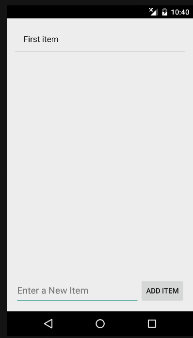

# SimpleTodo

This is an Android application which allows the user to add, edit, remove, and persist TODO items.

Time spent: 2 hours

Completed user stories:

 * [x] Required: User can add and remove items
 * [x] Required: User can edit TODO items
 * [x] Required: TODO items are persisted on app restart

Walkthrough of all user stories:

GIF created with [LiceCap](http://www.cockos.com/licecap/).
